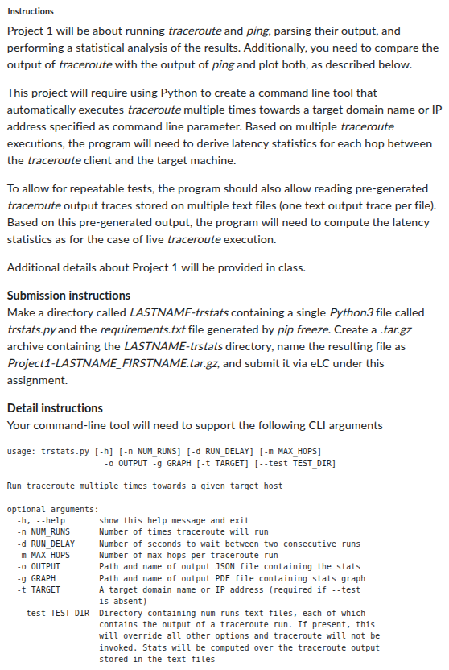
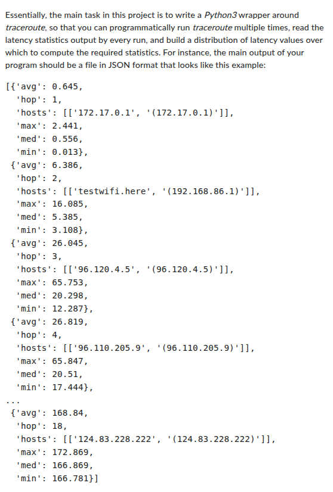
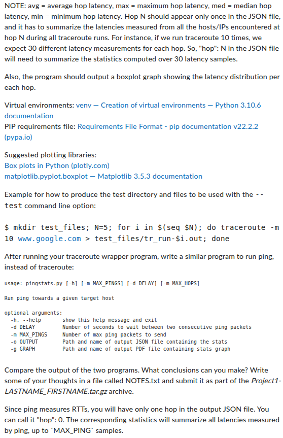

# Project 1 Description

   
   
  

This Project has been built to wrap around the Linux/Ubuntu terminal commands `traceroute` and `ping`. You may have to install the `traceroute` command, which can be done with the following.

    sudo apt install traceroute

This Project contains 2 Python programs, `trstats.py` and `pingstats.py`, that are used to run the `traceroute` and `ping` terminal commands, respectively. The scripts process the outputs of these terminal commands and use the data to calculate statistics and generate a box plot. Use the following commands to list the function and arguments of each script.

    python3 trstats.py -h
    python3 pingstats.py -h

The Python scripts send their results to the `/output` folder. Within the `/output` folder, you can find the resulting statistics within the `/stats` folder and the generated box plots within the `/box_plots` folder. If there is a an output in the `/stats` or `/box_plots` folders, running the Python scripts will generate a new file and replace the old files unless you change the output path or file name. The `/test` folder currently contains example output files after running the `traceroute` command 10 times. These test files can be utilized instead of generating new outputs with `tr_stats.py`. To do so, specify the directory with the `TEST_DIR` argument of `tr_stats.py`. See the command below.

    python3 trstats.py --test ../output/test

The `notes.txt` file contains my reflection on the results as mentioned in the Project Description.
