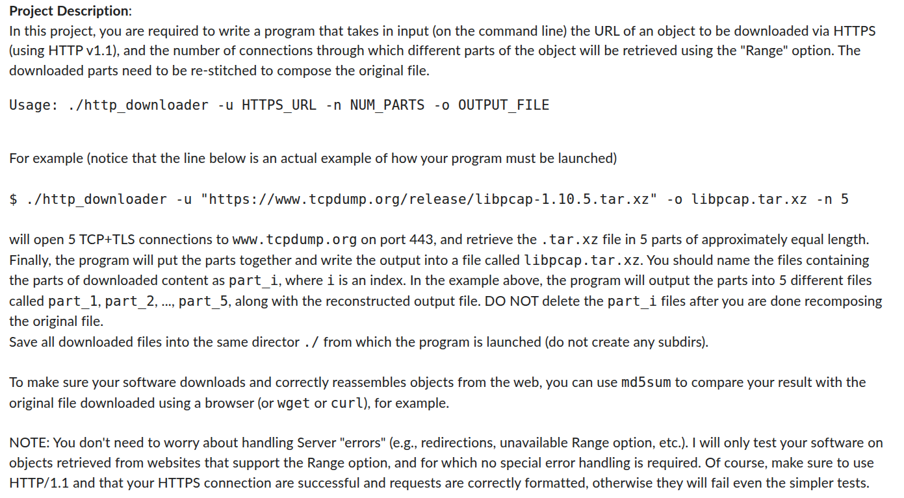

# Project 2 Description

   
   
   
  

This project implements C code to open a TCP socket, connect with TLS, and start parallel threads to perform a range download. To compile the code, go to the `/Project_2` folder and execute the make command.

    cd ~/perdiscor/Project_2
    make

This will create a program called `http_downloader`. To execute with default values, use the following.

    ./http_downloader

A number of arguments can be passed to this function. These are described below.

For example, if you want to perform a range download for the object at `google.com` with 5 parallel threads and output it to `image.jpg`, you would use the following.

    ./http_downloader -u https://arxiv.org/static/browse/0.3.4/images/arxiv-logo-one-color-white.svg -n 5 -o image.jpg

For the example above, the 5 parts downloaded by each separate thread will output to the `/Project_2` directory before being concatenated into the final `image.jpg`.

This code only works on websites with the range feature available. If the object supports range downloads, the HTTP GET responses printed in the terminal should reflect the following.

    HTTP GET Status #1
    ---------
    HTTP/1.1 206 Partial Content

If the range feature is unavailable for the desired object, the HTTP GET responses should print the following.

    HTTP GET Status #1
    ---------
    HTTP/1.1 200 OK

If this is the case, instead of the `part_*` files containing pieces of the final object, each part will contain the full object.
