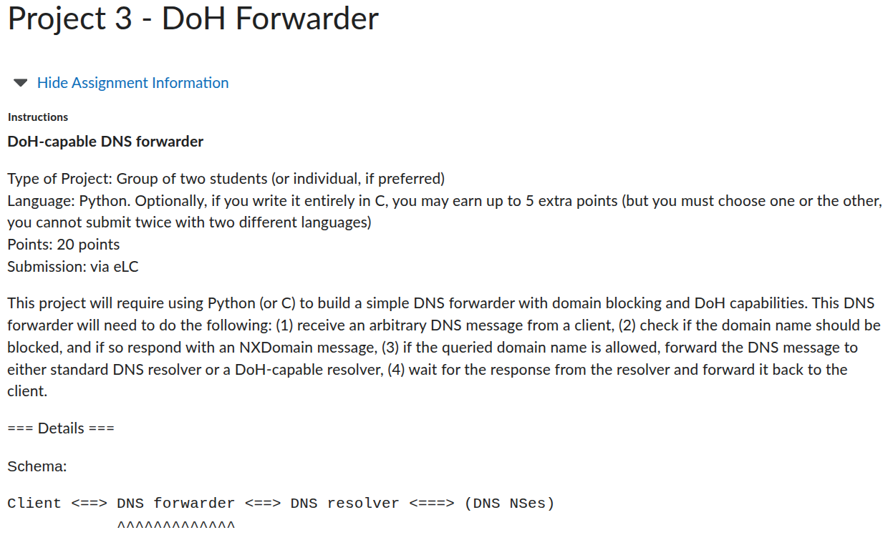
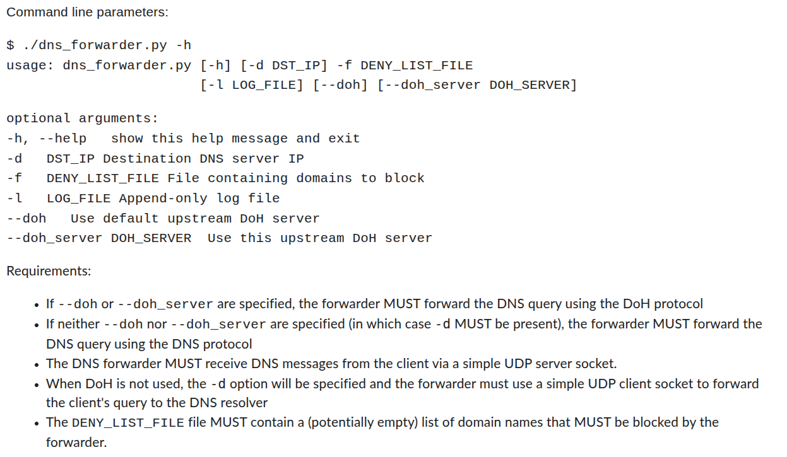
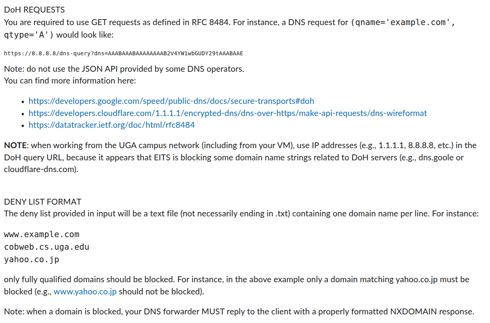
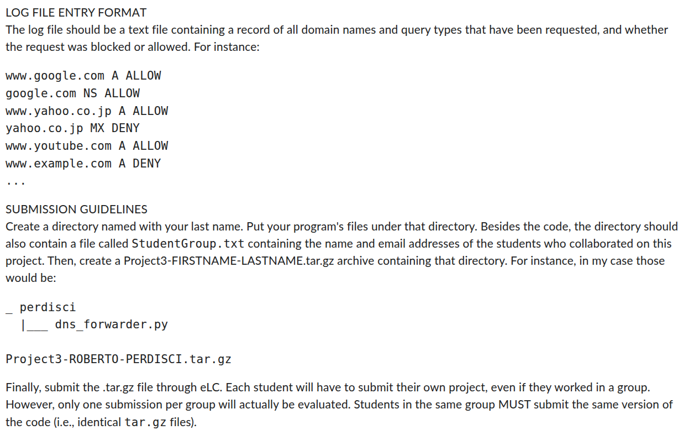
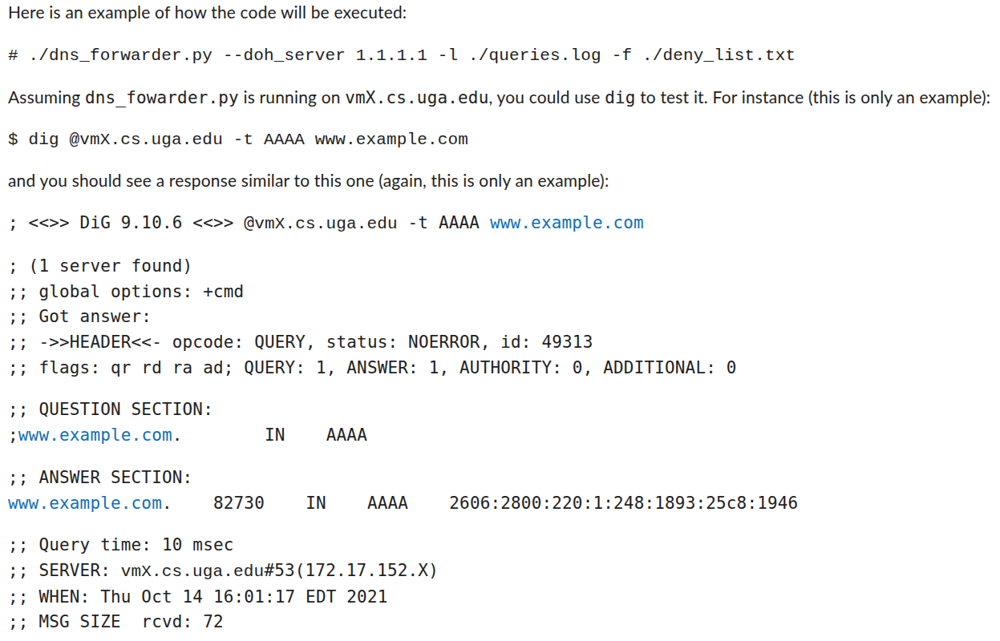
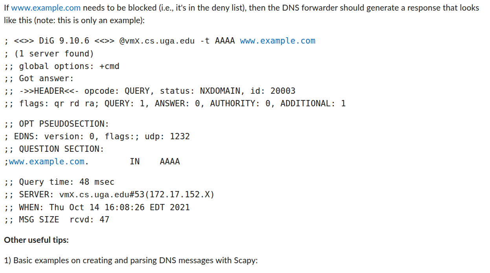
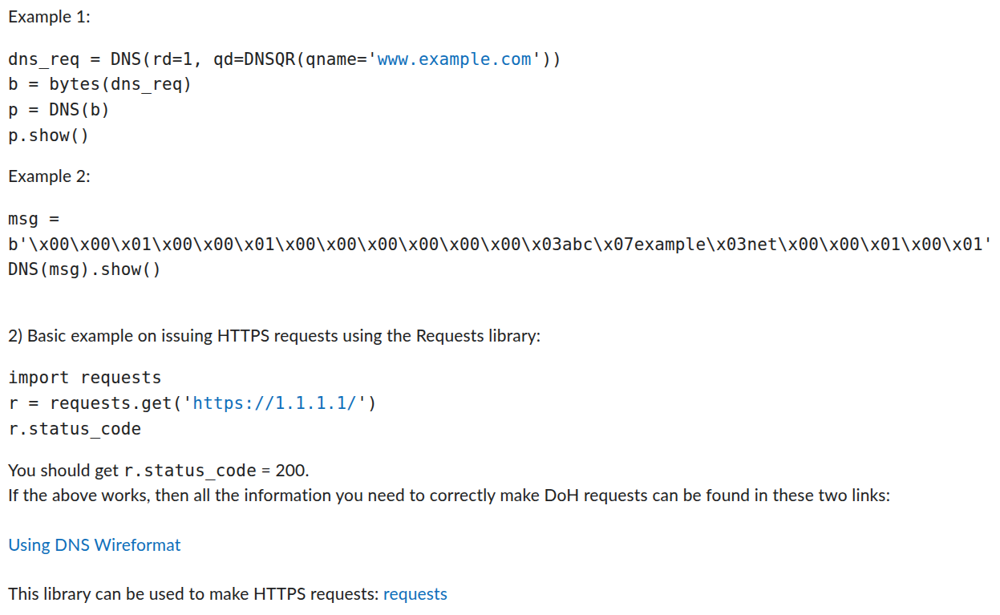
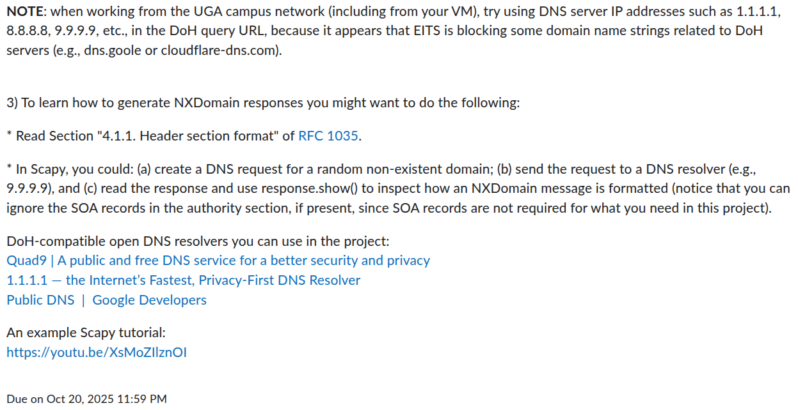

# Project 3 Description

   
   
   
   
   
   
   
  

## Instructions
This project implements Python code to act as a DNS Forwarder. The code opens a UDP socket at port 53 and listens for DNS requests. Upon receiving a DNS request, the script will first check if the requested domain is blocked as specified in the deny list file. If it is blocked, it will return an NXDomain or "non-existent domain" message back to the client. If the domain is allowed, it will forward the request do a DNS resolver using basic DNS over UDP protocol or DNS over HTTPS (DoH) protocol and forward the response bacl to the original client. In both cases, the requested domain and whether or not the domain is blocked is logged in the specified log file.

In order to execute the DNS forwarder, two external Python libraries must be downloaded. Create a Python virtual environment or Anaconda environment and use the following command to download the required libraries.

    pip install scapy requests

With these installed, you can now run the Python script `dns_dorwarder.py`. Because the program is opening a UDP socket at port 53, root privileges are required. First activate your Python environment where you installed the libraries above. Then use the following command to get the path to this environment.

    which python

Copy the output from the terminal and paste it into the following command to run `dns_forwarder.py`.

    cd ~/perdiscor/Project_3
    sudo <python path> dns_forwarder.py

A number of arguments can be passed to this function. These are described below.

* `-d DST_IP`: Destination DNS server IP  (Default="1.1.1.1")
* `-f DENY_LIST_FILE`: File containing domains to block  (Default="deny_list.csv")
* `-l LOG_FILE`: Append-only log file  (Default="log.csv")
* `--doh`: Use default upstream DoH server  (Default: False)
* `--doh_server DOH_SERVER`: Use this upstream DoH server  (Default="8.8.8.8")

For example, if your Python environment is located at `/home/jkruse/anaconda3/envs/dns/bin/python`, you wish to use the DoH protocol for server `8.8.8.8`, and the deny list is located at `~/deny_list.csv`, you would use the following command.

    sudo /home/jkruse/anaconda3/envs/dns/bin/python dns_forwarder.py -f ~/deny_list.csv --doh --doh_server 8.8.8.8

With the DNS Forwarder running, you can now send DNS queries to the program using `dig`. The script `dns_forwarder.py` will print the IP address of the machine on which it is running. With the DNS Forwarder running, in another terminal or on another machine, use the following command with the IP address printed by `dns_forwarder.py`.

    dig @[IP address] -t A www.example.com

If everything is up and running correctly, the terminal where you queried the DNS Forwarder should print the DNS response. If the domain is blocked, the response will look like the following.

    ; <<>> DiG 9.18.39-0ubuntu0.24.04.1-Ubuntu <<>> @172.19.52.135 -t A www.example.com
    ; (1 server found)
    ;; global options: +cmd
    ;; Got answer:
    ;; ->>HEADER<<- opcode: QUERY, status: NXDOMAIN, id: 33570
    ;; flags: qr rd ra; QUERY: 1, ANSWER: 0, AUTHORITY: 0, ADDITIONAL: 0

    ;; QUESTION SECTION:
    ;www.example.com.		IN	A

    ;; Query time: 4 msec
    ;; SERVER: 172.19.52.135#53(172.19.52.135) (UDP)
    ;; WHEN: Mon Oct 13 15:15:45 EDT 2025
    ;; MSG SIZE  rcvd: 33
