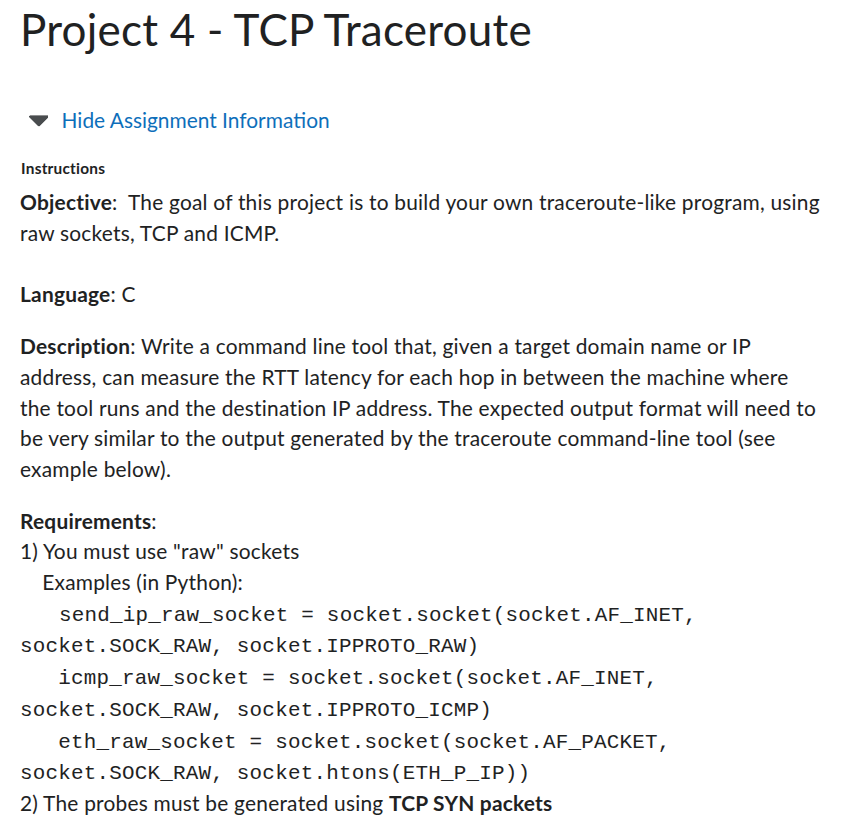
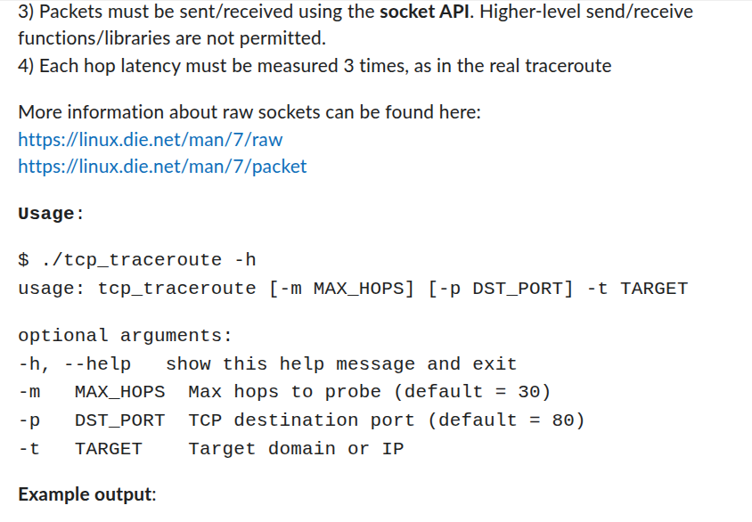
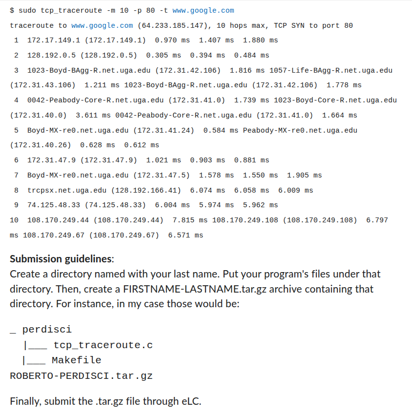

# Project 4 Description

   
   
  

## Instructions
This project implements C code to open a raw TCP socket and manually create the IP and TCP headers with an incremental Time-to-Live (TTL) field to simulate the `traceroute` command. To compile the code, go to the `/Project_4` folder and execute the make command.

    cd ~/perdiscor/Project_4
    make

This will create a program called `tcp_traceroute`. To execute with default values, use the following.

    sudo ./tcp_traceroute

A number of arguments can be passed to this function. These are described below.

* `-m MAX_HOPS`: This determines the maximum number of hops to probe (default: 30)
* `-p DST_PORT`: This determines the destintation port to send the traceroute probes (default: 80)
* `-t TARGET`: This determines the destination domain or IP to send the traceroute probes (default: google.com)

For example, if you want to perform tracreoute for `github.com` at port 443, you would use the following command.

    sudo ./tcp_traceroute -p 443 -t github.com

The result of the program will be printed to the terminal in the same format as the `traceroute` command.
